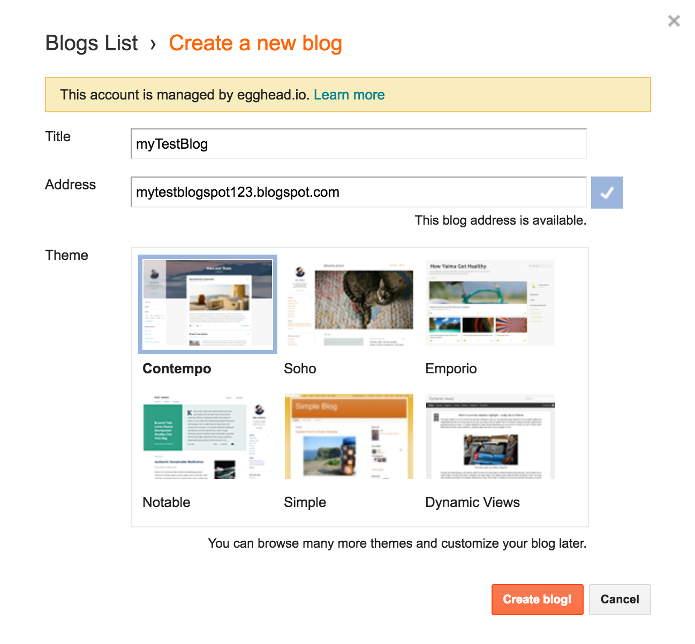
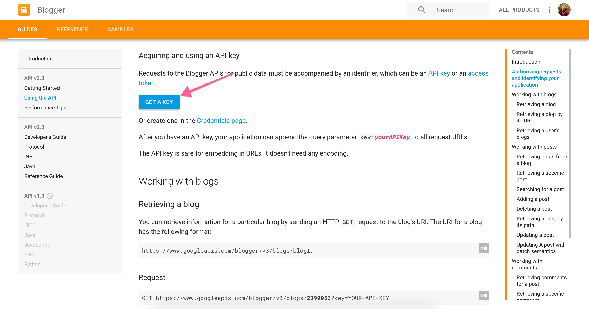
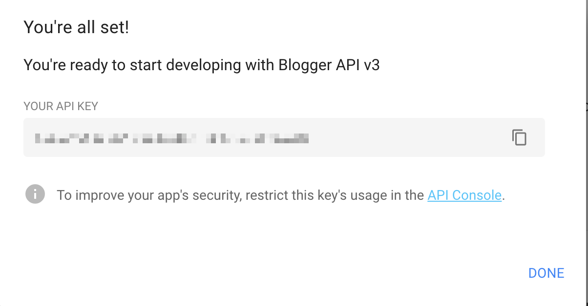

# Build a Server-rendered ReactJS Application with Next.js

## Description

In this course we we’ll see just how quickly next.js makes the process of building server-rendered ReactJS applications by creating and deploying an application that loads blog posts from the Google Blogger API. Along the way we’ll learn about many of the amazing features Next.js provides for us out of the box, such as route prefetching and code-splitting, thus allowing us to spend more time developing and virtually no time setting up our environment.

Additionally, we’ll learn about the core concepts behind the framework and see how we can leverage them to create dynamic routes and integrate Material-UI on the server. We won’t have to worry about using any specific architecture to handle state, instead we will just pass our data as ReactJS props using Next.js’ getInitialProps lifecycle hook. Throughout this course we will see why Next.js has gained such an amazing reputation as a “minimalist framework” by supplying users with “pretty” error messages. Once finished, we’ll deploy our application to a live URL using the now-cli npm module.

This course requires an account with Google Blogger which is described below.

## Set up Google's Blogger API

Visit the [Blogger homepage](https://www.blogger.com/about/).

Create an account or sign in.

Create a blog you want to use with your application. The name and url don't really matter as you will be using the blog ID.

#### Grab the blogID from the url:

Now that the blog is set up, you need to create a key for the blog. This can be done [here](https://developers.google.com/blogger/docs/3.0/using#APIKey) under `Acquiring and using an API key`

Agree to terms and services.

Copy the key that it provides you:

And finally, set both the `BLOGGER_URL` and `API_KEY` respectively:

